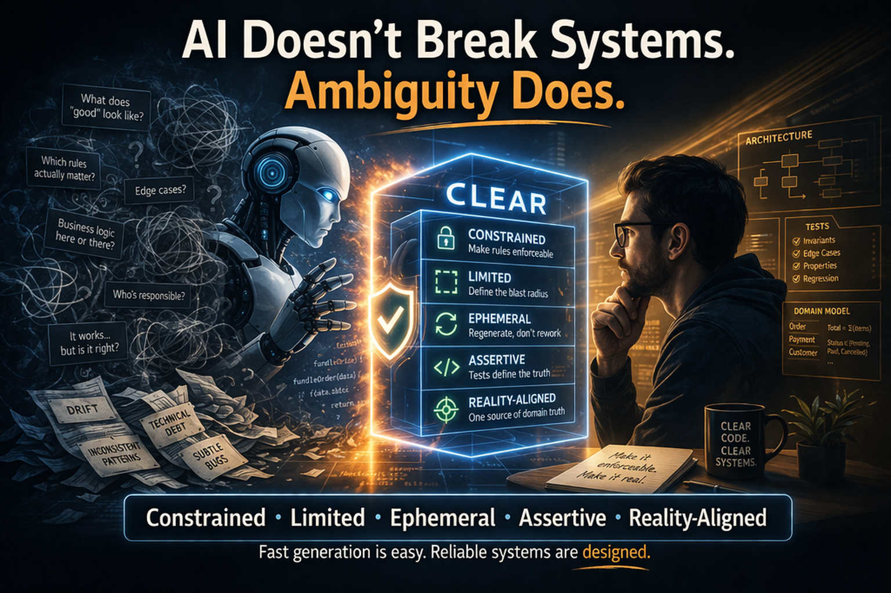

[](https://github.com/jketreno/clear/actions/workflows/ci.yml)

# CLEAR — AI-Assisted Development Framework

> **C**onstrained · **L**imited · **E**phemeral · **A**ssertive · **R**eality-Aligned

Developer release information...

| Topic | Document |
|-------|---------|
| Release runbook | [docs/release.md](docs/release.md) |
| Release notes template | [docs/release-notes-template.md](docs/release-notes-template.md) |

## Release Flow (Signed Installer)

Build and publish a release from a clean `main` branch:

```bash
./scripts/release.sh --yes
```

The release publishes three artifacts:

- `clear-installer-vX.Y.Z.sh`
- `clear-installer-vX.Y.Z.sha256`
- `clear-installer-vX.Y.Z.sha256.asc`

Public verification key in-repo:

- `docs/keys/clear-release-signing-public.asc`

Signing key fingerprint:

- `35CD F523 D2E6 E479 53FC A25F A404 671B FB78 0D6E`

Before running the installer, verify signature and checksum:

```bash
gpg --verify clear-installer-vX.Y.Z.sha256.asc clear-installer-vX.Y.Z.sha256
sha256sum -c clear-installer-vX.Y.Z.sha256
```

Installer entrypoint supports install/update and extract mode:

```bash
# Install or update in one command
bash clear-installer-vX.Y.Z.sh --target /path/to/repo

# Extract payload for inspection without install/update
bash clear-installer-vX.Y.Z.sh --extract /tmp/clear-extract
```

Default installer behavior leaves no extraction artifacts outside the target repository.
