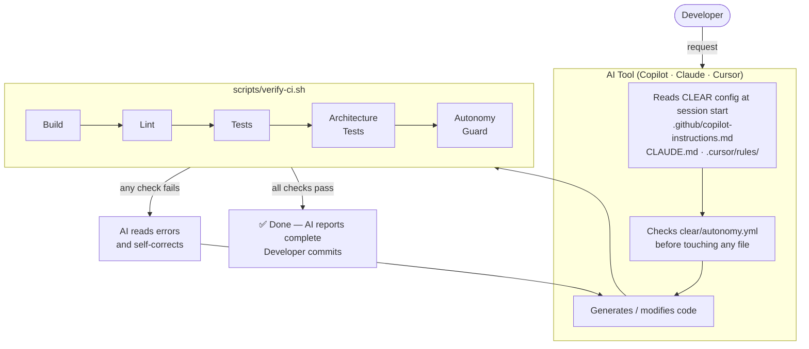

[](https://github.com/jketreno/clear/actions/workflows/ci.yml)

# CLEAR — AI-Assisted Development Framework

> **C**onstrained · **L**imited · **E**phemeral · **A**ssertive · **R**eality-Aligned

CLEAR keeps your architecture rules **enforced, not suggested** when working with AI coding tools — from single-session assistants to multi-agent pipelines. One script. Five principles. Works with GitHub Copilot, Claude Code, Cursor, and MCP-compatible agent frameworks.

---

## How It Works



---

## The Five Principles

| # | Principle | What it means |
|---|-----------|---------------|
| **C** | **Constrained** | Architecture rules are enforced by scripts and tests, not code review |
| **L** | **Limited** | Modules are tagged `full-autonomy`, `supervised`, or `humans-only` |
| **E** | **Ephemeral** | Generated code is regenerated from source, never hand-edited |
| **A** | **Assertive** | Tests enforce invariants, not just confirm the current implementation |
| **R** | **Reality-Aligned** | Domain models derive from a declared single source of truth |

---

## Quick Start

### 1 — Clone the seed repo

```bash
git clone https://github.com/jketreno/clear
cd clear
```

### 2 — Bootstrap CLEAR into your project

```bash
# Preview what will be copied:
./scripts/bootstrap-project.sh --dry-run /path/to/your-project

# Apply (copies files + runs setup wizard):
./scripts/bootstrap-project.sh /path/to/your-project
```

The bootstrap script copies all CLEAR files into your project, preserves existing files, makes scripts executable, and launches the setup wizard to configure `clear/autonomy.yml`.

**Then let AI suggest your initial autonomy boundaries** (use PLAN mode — don't implement yet):

```
PLAN MODE — do not write any files yet.

Analyze this codebase and propose an initial clear/autonomy.yml configuration.
For each significant module or directory, recommend one of:
  - full-autonomy  (safe to AI-generate freely: utilities, client wrappers, generated types)
  - supervised     (AI generates, human reviews: business logic, DB migrations, API handlers)
  - humans-only    (no AI generation: auth, payments, security-critical code, core domain models)

For each recommendation, explain why. Also identify 2–3 domain concepts that need
a declared source of truth (e.g. "User is defined in the DB schema, not the API layer").

Show me the proposed autonomy.yml content. Wait for my approval before writing anything.
```

Review the plan, adjust any boundaries, then tell the AI to write `clear/autonomy.yml`.

### 3 — Add your project's checks to verify-ci.sh

**Let AI detect your stack and update the script automatically:**

```
PLAN MODE — do not write any files yet.

Analyze this codebase and identify:
1. Build tools in use (tsc, webpack, cargo, go build, etc.)
2. Linters and formatters configured (ESLint, Prettier, Ruff, Black, golangci-lint, etc.)
3. Test frameworks and how to run them (jest, pytest, go test, etc.)
4. Any existing architecture or integration tests

For each tool found, show me the exact run_check() line to add to scripts/verify-ci.sh,
placed in the correct section (Build / Linting / Tests / Architecture Tests).

If a tool is configured but has no runnable command yet, note it as a recommendation.
Show me the full proposed additions. Wait for my approval before editing the script.
```

Once you approve, tell the AI: `"Apply the plan — update scripts/verify-ci.sh now."`

Or if you prefer to edit manually, here are examples:

```bash
# Node.js
run_check "TypeScript build" "npm run build 2>&1"
run_check "ESLint"           "npx eslint . 2>&1"
run_check "Jest"             "npm test 2>&1"

# Python
run_check "Ruff"   "ruff check . 2>&1"
run_check "Mypy"   "mypy . 2>&1"
run_check "pytest" "pytest --tb=short -q 2>&1"
```

**Validate the script works before relying on it:**

```
Run scripts/verify-ci.sh and show me the full output.
For any check that fails, tell me whether it's a real issue in the codebase
or a configuration problem with the check itself.
Do not fix anything yet — just report.
```

### 4 — Turn your first code review rule into a constraint

Before wiring up your AI tool, pick one recurring code review comment and make it automatic:

```
I want to turn this code review rule into an enforced constraint:
"[paste your most common review comment here]"

In PLAN mode:
1. What type of check best enforces this — linter rule, architecture test, or build flag?
2. Show me the exact code for the check.
3. Show me the run_check() line to add to scripts/verify-ci.sh.
4. Write one failing test that proves the rule is enforced.

Wait for my approval before writing any files.
```

### 5 — Tell your AI to run it

The config files already contain this rule, but confirm your AI tool loads them:

| Tool | Config auto-read |
|------|-----------------|
| GitHub Copilot | `.github/copilot-instructions.md` |
| Claude Code | `CLAUDE.md` |
| Cursor | `.cursor/rules/*.mdc` |

The core rule every AI config enforces:

> **Run `./scripts/verify-ci.sh` before reporting work as complete. If it fails, fix the issues and run again. Never say "done" if it fails.**

**Verify your AI is actually following the rule:**

```
Without making any code changes, run scripts/verify-ci.sh and show me the complete output.
Then tell me: which checks are currently enabled in this project, and which sections
are empty placeholders waiting to be configured?
```

---

## What's Included

```
scripts/
  verify-ci.sh          — The enforcement script. Run this. Always.
  setup-clear.sh        — Interactive setup wizard
  bootstrap-project.sh  — Copy CLEAR into an existing project
  update-project.sh     — Sync a bootstrapped project with the latest CLEAR seed

clear/
  autonomy.yml          — Module boundaries (full-autonomy / supervised / humans-only)
  principles.md         — AI quick-reference card (read at session start)

templates/
  agent-configs/        — AI tool configs copied into user projects by bootstrap
    .github/            — GitHub Copilot instruction files
    .cursor/rules/      — Cursor MDC rule files (6, all annotated)
    .claude/commands/   — Claude slash commands (/project:verify, check-autonomy, update-autonomy)
    .vscode/            — VS Code tasks, settings, recommended extensions
    CLAUDE.md           — Claude Code root config (auto-read)
    .cursorrules        — Legacy Cursor fallback
  architecture-tests/   — Copy-paste test templates (API rules, type sync, autonomy guard)
  skills/               — AI skill files for type sync, API endpoints, reality tests
  linting/              — ESLint config templates (flat + legacy)
  github-actions/       — CI/CD workflow template

.github/                — Copilot configs for developing the CLEAR seed repo itself
.cursor/rules/          — Cursor configs for developing the CLEAR seed repo itself
.claude/commands/       — Claude configs for developing the CLEAR seed repo itself
CLAUDE.md               — Claude root config for the CLEAR seed repo itself
docs/                   — Full documentation
```

---

## Learn More

| Topic | Document |
|-------|---------|
| Full setup walkthrough | [docs/getting-started.md](docs/getting-started.md) |
| Enforcement with tests | [docs/principles/constrained.md](docs/principles/constrained.md) |
| Autonomy boundaries | [docs/principles/limited.md](docs/principles/limited.md) |
| Generated code workflows | [docs/principles/ephemeral.md](docs/principles/ephemeral.md) |
| Writing constraint tests | [docs/principles/assertive.md](docs/principles/assertive.md) |
| Sources of truth | [docs/principles/reality-aligned.md](docs/principles/reality-aligned.md) |
| VS Code / Copilot setup | [docs/ai-tools/vscode-copilot.md](docs/ai-tools/vscode-copilot.md) |
| Claude Code setup | [docs/ai-tools/claude.md](docs/ai-tools/claude.md) |
| Cursor setup | [docs/ai-tools/cursor.md](docs/ai-tools/cursor.md) |
| Agentic workflows & MCP | [docs/agentic.md](docs/agentic.md) |
| Origin & philosophy | [ORIGIN.md](ORIGIN.md) |
